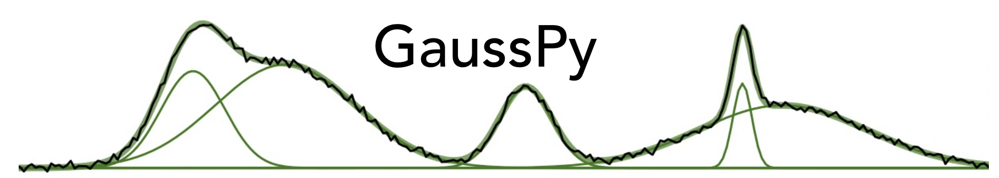

.. image:: http://readthedocs.org/projects/gausspy/badge/?version=latest
   :target: https://gausspy.readthedocs.io/en/latest/
   :alt: Documentation Status

.. image:: https://travis-ci.org/cmurray-astro/gausspy.svg?branch=master
    :target: https://travis-ci.org/cmurray-astro/gausspy
    :alt: Build Status

.. image:: https://coveralls.io/repos/github/cmurray-astro/gausspy/badge.svg?branch=master
    :target: https://coveralls.io/github/cmurray-astro/gausspy?branch=master
    :alt: Coverage Status

.. image:: http://img.shields.io/badge/arXiv-1409.2840-skyblue.svg?style=flat
    :target: https://arxiv.org/abs/1409.2840
    :alt: arXiv paper

A python tool for implementing the Autonomous Gaussian Decomposition (AGD) algorithm.

**Authors**: Robert R. Lindner, Carlos Vera-Ciro, Claire E. Murray, Elijah Bernstein-Cooper

The full details of AGD can be found in `Lindner et al. (2015) <https://arxiv.org/abs/1409.2840>`_

===============
Documentation
===============

Details of installing, running, and contributing to the GaussPy are at
<http://gausspy.readthedocs.io>.

===============
Contributing
===============

Please open a new issue or new pull request for bugs, feedback, or new features
you would like to see.   If there is an issue you would like to work on, please
leave a comment and we will be happy to assist.   New contributions and
contributors are very welcome!

New to github or open source projects?  If you are unsure about where to start
or haven't used github before, please feel free to contact us.
Want more information about how to make a contribution?  Take a look at
the astropy `contributing`_ and `developer`_ documentation.

Feedback and feature requests?   Is there something missing you would like
to see?  Please open an issue!
GaussPy follows the `Astropy Code of Conduct <http://www.astropy.org/about.html#codeofconduct>`_ 
and strives to provide a welcoming community to all of our users and contributors.

We love contributions! GaussPy is open source,
built on open source, and we'd love to have you hang out in our community.

**Imposter syndrome disclaimer**: We want your help. No, really.

There may be a little voice inside your head that is telling you that you're not
ready to be an open source contributor; that your skills aren't nearly good
enough to contribute. What could you possibly offer a project like this one?

We assure you - the little voice in your head is wrong. If you can write code at
all, you can contribute code to open source. Contributing to open source
projects is a fantastic way to advance one's coding skills. Writing perfect code
isn't the measure of a good developer (that would disqualify all of us!); it's
trying to create something, making mistakes, and learning from those
mistakes. That's how we all improve, and we are happy to help others learn.

Being an open source contributor doesn't just mean writing code, either. You can
help out by writing documentation, tests, or even giving feedback about the
project (and yes - that includes giving feedback about the contribution
process). Some of these contributions may be the most valuable to the project as
a whole, because you're coming to the project with fresh eyes, so you can see
the errors and assumptions that seasoned contributors have glossed over.

*This disclaimer was originally written by*
`Adrienne Lowe <https://github.com/adriennefriend>`_ *for a*
`PyCon talk <https://www.youtube.com/watch?v=6Uj746j9Heo>`_, *and was adapted by
GaussPy based on its use in the README file for the*
`BEAST project <https://github.com/BEAST-Fitting/beast>`_, *and the*
`MetPy project <https://github.com/Unidata/MetPy>`_.

.. _AstroPy: http://www.astropy.org/
.. _contributing: http://docs.astropy.org/en/stable/index.html#contributing
.. _developer: http://docs.astropy.org/en/stable/index.html#developer-documentation
