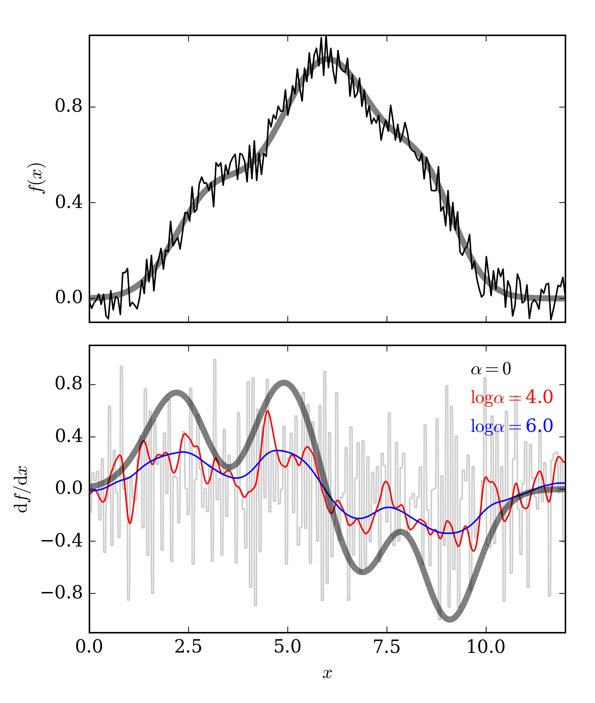

.. _method:

=================
Behind the Scenes
=================

Basic concepts
--------------

``GaussPy`` is a Python implementation of the AGD algorithm described
in `Lindner et al. (2015), AJ, 149, 138
<http://iopscience.iop.org/article/10.1088/0004-6256/149/4/138/meta>`_. At
its core, AGD is a fast, automatic, extremely versatile way of
providing initial guesses for fitting Gaussian components to a
function of the form :math:`f(x) + n(x)`, where :math:`n(x)` is a term
modeling possible contributions from noise. It is important to
emphasize here that although we use terminology coming from
radio-astronomy all the ideas upon which the code is founded can be
applied to any function of this form, moreover, non-Gaussian
components can also be in principle extracted with our methodology,
something we will include in a future release of the code.

Ideally, if blending of components was not an issue and :math:`n(x)=0`
the task of fitting Gaussians to a given spectrum would be reduced to
find local maxima of :math:`f(x)`. However, both of these assumptions
dramatically fail in practical applications, where blending of lines
is an unavoidable issue and noise is intrinsic to the process of data
acquisition. In that case, looking for solutions of :math:`{\rm
d}f(x)/{\rm d}x = 0` is not longer a viable route to find local
extrema of :math:`f(x)`, instead a different approach must be taken.

AGD uses the fact that a local maximum in :math:`f(x)` is also a local
minimum in the curvature. That is, the algorithm looks for points
:math:`x^*` for which the following conditions are satisfied.

* The function :math:`f(x)` has a non-trivial value

.. math::  f(x^*) > \epsilon_0.

In an ideal situation where the contribution from noise vanishes we
can take :math:`\epsilon_0=0`. However, when random fluctuations are
added to the target function, this condition needs to be modified
accordingly. A good selection of :math:`\epsilon_0` thus needs to be
in proportion to the RMS of the analyzed signal.
      

* Next we require that the function :math:`f(x)` has a "bump" in
  :math:`x^*`

.. math::  \left.\frac{{\rm d}^2f}{{\rm d}x^2}\right|_{x=x^*}  < 0,

this selection of the inequality ensures also that such feature has
negative curvature, or equivalently, that the point :math:`x^*` is
candidate for being the position of a local maximum of
:math:`f(x)`. Note however that this is not a sufficient condition, we
also need to ensure that the curvature has a minimum at this location.
      
* This is achieved by imposing two additional constraints on
  :math:`f(x)`

.. math:: \left.\frac{{\rm d}^3f}{{\rm d}x^3}\right|_{x=x^*} = 0

.. math:: \left.\frac{{\rm d}^4f}{{\rm d}x^4}\right|_{x=x^*} > 0
            

These 4 constraints then ensure that the point :math:`x^*` is a local
minimum of the curvature. Furthermore, even in the presence of both
blending and noise, these expressions will yield the location of all
the points that are possible candidates for the positions of Gaussian
components in the target function. The following is an
example of a function defined as the sum of three gaussians for which
the above conditions are satisfied and the
local minima of curvature are successfully found, even when blending
of components is relevant.

.. _curvature:

.. figure:: curvature.png
    :width: 4in
    :align: center
    :figclass: align-center
    :alt: alternate text

    Example of the points of negative curvature of the function
    :math:`f(x)`. In this case :math:`f(x)` is the sum of three
    independent Gaussian functions (top). The vertical lines in each
    panel show the conditions imposed on the derivatives to define the
    points :math:`x^*`.

Dealing with noise
------------------

The numeral problem related to the solution shown in the previous
section comes from the fact that calculating derivatives
is not trivial in the presence of noise. For instance,
if the top panel of our example figure is sampled with 100
channels, and in each panel a random uncorrelated noise component is
added at the 10% level, a simple finite difference prescription to
calculate the derivative would lead to variations of the order
:math:`\sim 1 / {\rm d}x \sim 10`. That is, the signal would be buried
within the noise! 

.. _deriv:

    The top panel shows the same function used in
    the first example figure, but now random noise has been added to each
    channel. In the bottom panel we show various estimates of the
    first derivative. :math:`\alpha=0` corresponds to the finite
    differences method, larger values of :math:`\alpha` makes the
    function smoother.

In order to solve this problem AGD uses a regularized version of the
derivative (`Vogel (2002)
<http://www.amazon.com/Computational-Methods-Problems-Frontiers-Mathematics/dp/0898715075>`_). If
:math:`u = {\rm d}f(x)/{\rm d}x`, then the problem we solve is
:math:`u = {\rm arg}\min_u\{R[u]\}` where :math:`R[u]` is the
functional defined by

.. math:: R[u] = \int | A u - f | + \alpha \int \sqrt{(Du)^2 +
          \beta^2},

where :math:`A u = \int {\rm d}x\; u`. Note that if :math:`\alpha=0`
this is equivalent to find the derivative of the function
:math:`f(x)`, since we will be minimizing the difference between the
integral of :math:`u = {\rm d}f(x)/{\rm d}x` and :math:`f(x)`
itself. This, however, has the problem we discussed in the previous
paragraph. It is clear that this
simple approach fails to recover the behavior of the target
function. If, on the other hand, :math:`\alpha > 0`, an additional
weight is added to the inverse problem in the equation for :math:`R[u]`, 
and now the differences between successive points in :math:`u(x)` are taken into
account. 

The parameter :math:`\alpha` then controls how smooth the derivative
is going to be. The risk here is that overshooting the value of this
number can erase the intrinsic variations of the actual
derivative. What is the optimal value of :math:`\alpha`? This question
is answered by ``GaussPy`` through the training process of the
algorithm. We refer the reader to the example chapters to learn how to
use this feature.

Two phases
----------
 
Within ``GaussPy`` is built-in the ability to automatically choose the
best value of :math:`\alpha` for any input data set. Special caution
has to be taken here. If a component is too narrow it can be confused
with noise and smoothed away by the algorithm!

In order to circumvent this issue ``GaussPy`` can be trainend in
"two-steps". One for narrow components, and one for broad
components. The result then is two independent values :math:`\alpha_1`
and :math:`\alpha_2` each giving information about the scales of
different features in the target function.

An alternative approach
-----------------------

There is another alternative for calculating derivatives of
noise-ridden data, namely convolving the function with a low-pass
filter kernel, e.g., a Gaussian filter. Although the size of the
filter can be optimized by using a training routine, in a similar
fashion as we did for the :math:`\alpha` scales, this technique is much
more agressive and could lead to losses of important features in the
signal. Indeed, the total variation scheme that ``GaussPy`` uses could
be thought of as the first order approximation in a perturbative
expansion of a Gaussian filter.

Notwhistanding this caveat ``GaussPy`` implements also a Gaussian
filter as an option for taking the numerical derivatives. In total,
there are three selectable ``modes`` within the package for
calculating :math:`f(x) + n(x)` 

* ``GaussianDecomposer.set('mode','python')``: This will execute
  ``GaussPy`` with a ``Python`` implementation of the total variation
  algorithm. The code is clean to read, easy to understand and modify,
  but it may perform slow for large datasets.

* ``GaussianDecomposer.set('mode','conv')``: When this mode is set,
  the function is Gaussian-filtered prior to calculating the numerical
  derivative. In this case, the constant :math:`\alpha` is taken to be
  the size of the kernel

  .. math:: \tilde{f}(x) = (f \star K_\alpha)(x) \quad\mbox{with}\quad
	  K_\alpha(x) = \frac{1}{\sqrt{2\pi \alpha^2}}{\rm e}^{-x^2/2\alpha^2}.
     :label: kernel

  Once this mode is selected the training for choosing the optimal
  size of the filter proceeds in the same way we have discussed in the
  previous sections, i.e., nothing else has to be changed.

