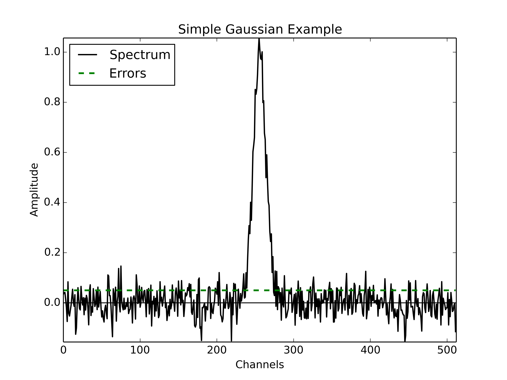
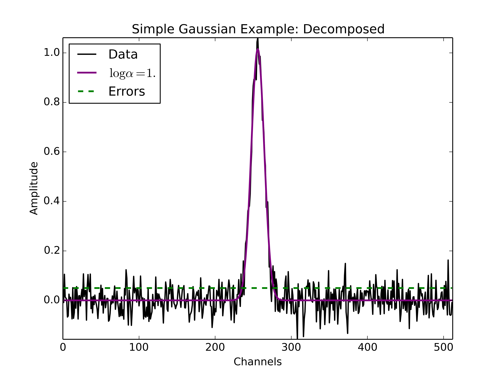
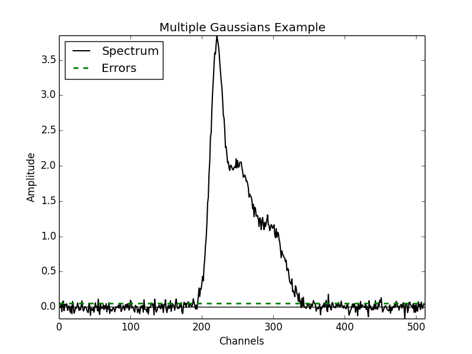

.. _simple-example-tutorial:

=======================================
Simple Example Tutorial
=======================================

Constructing a GaussPy-Friendly Dataset
----------------------------------------

Before implementing AGD, we first must put data into a format readable by
GaussPy. GaussPy requires the indepenent and dependent spectral arrays (e.g.,
channels and amplitude) and an estimate of the per-channel noise in the specrum.

To begin, we can create a simple Gaussian function of the form:

.. math::
    S(x_i) = \sum_{k=1}^{\texttt{NCOMPS}} {\texttt{AMP}_k} \exp\left[-\frac{4\ln 2 (x_i
    - \texttt{MEAN}_k)^2}{\texttt{FWHM}_k^2} \right] + \texttt{NOISE},
    \qquad i = 1, \cdots, \texttt{NCHANNELS}
    :label: spectra

where,

1. ``NCOMPS`` is the number of Gaussian components in each spectrum.

2. ``(AMP, MEAN, FWHM)`` are the amplitude, mean location, and
   full-width-half-maximum of each Gaussian component.

3. ``NCHANNELS`` is the number of channels in the spectrum (sets the
   resolution).

4. ``NOISE`` is the level of noise introduced in each spectrum, described by the root mean square (RMS) noise per channel.

In the next example we will show how to implement this in python. We have made
the following assumptions:

1. ``NCOMPS = 1`` (to begin with a simple, single Gaussian)

2. ``AMP = 1.0, MEAN = 256, FWHM = 20`` (fixed Gaussian parameters)

3. ``NCHANNELS = 512``

4. ``RMS = 0.05``

In the following figure we display the spectrum with the single Gaussian
described above.

.. _simple-gaussian:



    Example spectrum containing a single Gaussian function with added spectral noise.

The following code describes an example of how to create a spectrum
with a Gaussian shape and store the channels, amplitude and error arrays in a
python pickle file to be read later by GaussPy.

.. code-block:: python

    # Create simple Gaussian profile with added noise
    # Store in format required for GaussPy

    import numpy as np
    import pickle

    # create a function which returns the values of the Gaussian function for a
    # given x
    def gaussian(amp, fwhm, mean):
        return lambda x: amp * np.exp(-4. * np.log(2) * (x-mean)**2 / fwhm**2)

    # Data properties
    RMS = 0.05
    NCHANNELS = 512
    FILENAME = 'simple_gaussian.pickle'

    # Component properties
    AMP = 1.0
    FWHM = 20
    MEAN = 256

    # Initialize
    data = {}
    chan = np.arange(NCHANNELS)
    errors = np.ones(NCHANNELS) * RMS

    spectrum = np.random.randn(NCHANNELS) * RMS
    spectrum += gaussian(AMP, FWHM, MEAN)(chan)

    # Enter results into AGD dataset
    data['data_list'] = data.get('data_list', []) + [spectrum]
    data['x_values'] = data.get('x_values', []) + [chan]
    data['errors'] = data.get('errors', []) + [errors]

    pickle.dump(data, open(FILENAME, 'w'))


Running GaussPy
----------------------------

With our simple dataset in hand, we can use GaussPy to decompose the spectrum
into Gaussian functions. To do this, we must specify the smoothing parameter
:math:`\alpha` (see Behind the Scenes chapter for more details). For now, we
will guess a value of :math:`\log\alpha=1`. In later chapters
we will discuss training the AGD algorithm to select the optimal value of
:math:`\alpha`.

The following is an example code for running GaussPy. We will use the "one-phase" decomposition to begin with. We must specify the following parameters:

1. ``alpha1``: our choice for the value of :math:`\log\alpha`.

2. ``snr_thresh``: the signal-to-noise ratio threshold below which amplitude GaussPy will not fit a component.

3. ``FILENAME_DATA``: the filename containing the dataset to-be-decomposed, constructed in the previous section (or any GaussPy-friendly dataset)

4. ``FILENAME_DATA_DECOMP``: filename to store the decomposition results from GaussPy.


.. code-block:: python

    # Decompose simple dataset using AGD
    import pickle
    import gausspy.gp as gp

    # Specify necessary parameters
    alpha1 = 1.
    snr_thresh = 5.
    FILENAME_DATA = 'simple_gaussian.pickle'
    FILENAME_DATA_DECOMP = 'simple_gaussian_decomposed.pickle'

    # Load GaussPy
    g = gp.GaussianDecomposer()

    # Setting AGD parameters
    g.set('phase', 'one')
    g.set('SNR_thresh', [snr_thresh, snr_thresh])
    g.set('alpha1', alpha1)

    # Run GaussPy
    data_decomp = g.batch_decomposition(FILENAME_DATA)

    # Save decomposition information
    pickle.dump(data_decomp, open(FILENAME_DATA_DECOMP, 'w'))

After AGD determines the Gaussian decomposition, GaussPy then performs a least squares fit of the inital AGD model to the data to produce a final fit solution. The file containing the fit results is a python pickle file. The contents of this file can be viewed by printing the keys within the saved dictionary via,

.. code-block:: python

    print data_decomp.keys()

The most salient information included in this file are the values for the ``amplitudes``, ``fwhms`` and ``means`` of each fitted Gaussian component. These include,

1. ``amplitudes_initial, fwhms_initial, means_initial`` : the parameters of each Gaussian component determined by AGD (each array has length equal to the number of fitted components).

2. ``amplitudes_fit, fwhms_fit, means_fit`` : the parameters of each Gaussian component following a least-squares fit of the initial AGD model to the data.

3. ``amplitudes_fit_err, fwhms_fit_err, means_fit_err`` : uncertainities in the fitted Gaussian parameters, determined from the least-squares fit.

GaussPy also stores the reduced :math:`\chi^2` value from the least-squares fit (``rchi2``), but this is currently under construction. This value can be computed outside of GaussPy easily.


Plot Decomposition Results
----------------------------

The following is an example python script for plotting the original spectrum and GaussPy decomposition results. We must specify the following parameters:

1. ``FILENAME_DATA``: the filename containing the dataset to-be-decomposed.

2. ``FILENAME_DATA_DECOMP``: the filename containing the GaussPy decomposition results.

.. code-block:: python

    # Plot GaussPy results
    import numpy as np
    import matplotlib.pyplot as plt
    import pickle

    def gaussian(amp, fwhm, mean):
        return lambda x: amp * np.exp(-4. * np.log(2) * (x-mean)**2 / fwhm**2)

    def unravel(list):
        return np.array([i for array in list for i in array])

    FILENAME_DATA = 'simple_gaussian.pickle'
    FILENAME_DATA_DECOMP = 'simple_gaussian_decomposed.pickle'

    data = pickle.load(open(FILENAME_DATA))
    spectrum = unravel(data['data_list'])
    chan = unravel(data['x_values'])
    errors = unravel(data['errors'])

    data_decomp = pickle.load(open(FILENAME_DATA_DECOMP))
    means_fit = unravel(data_decomp['means_fit'])
    amps_fit = unravel(data_decomp['amplitudes_fit'])
    fwhms_fit = unravel(data_decomp['fwhms_fit'])

    fig = plt.figure()
    ax = fig.add_subplot(111)

    model = np.zeros(len(chan))

    for j in range(len(means_fit)):
        component = gaussian(amps_fit[j], fwhms_fit[j], means_fit[j])(chan)
        model += component
        ax.plot(chan, component, color='red', lw=1.5)

    ax.plot(chan, spectrum, label='Data', color='black', linewidth=1.5)
    ax.plot(chan, model, label = r'$\log\alpha=1.$', color='purple', linewidth=2.)
    ax.plot(chan, errors, label = 'Errors', color='green', linestyle='dashed', linewidth=2.)

    ax.set_xlabel('Channels')
    ax.set_ylabel('Amplitude')

    ax.set_xlim(0,len(chan))
    ax.set_ylim(np.min(spectrum),np.max(spectrum))
    ax.legend(loc=2)

    plt.show()


The following figure displays the results of the
decomposition using the above example python code. Clearly the fit to the simple
Gaussian spectrum is good. If we were to vary the value of :math:`\log\alpha`, the
fit would not change significantly as the fit to a spectrum containing a single
Gaussian funciton does not depend sensitively on the initial guesses, especially
because GaussPy performs a least-squares fit after determining initial guesses
for the fitted Gaussian parameters with AGD.

.. _simple-gaussian-decomposed:



    Example spectrum containing a single Gaussian function with added spectral noise, decomposed using GaussPy.

In the ensuing chapters, we will move on from this simple example to consider spectra of increased complexity, as well as the effect of different values of :math:`\alpha` on the decomposition.

.. _multiple-gaussians-tutorial:

=============================
Multiple Gaussians Tutorial
=============================


Constructing a GaussPy-Friendly Dataset
-----------------------------------------

As discussed in the :ref:`simple-example-tutorial`, before running GaussPy we
must ensure that our data is in a format readable by GaussPy. In particular, for
each spectrum, we need to provide the independent and dependent spectral arrays
(i.e. channels and amplitudes) and an estimate of the uncertainity per channel.
In the following example we will construct a spectrum containing multiple
overlapping Gaussian components with added spectral noise, using Equation
:eq:`spectra`, and plot the results.

We will make the following choices for parameters in this example:

1. ``NCOMPS = 3`` : to include 3 Gaussian functions in the spectrum

2. ``AMPS = [3,2,1]`` : amplitudes of the included Gaussian functions

3. ``FWHMS = [20,50,40]`` : FWHM (in channels) of the included Gaussian functions

4. ``MEANS = [220,250,300]`` : mean positions (in channels) of the included Gaussian functions

5. ``NCHANNELS = 512`` : number of channels in the spectrum

6. ``RMS = 0.05`` : RMS noise per channel

7. ``FILENAME`` : name of file to write output data to

The following code provides an example of how to construct a Gaussian function
with the above parameters and store it in GaussPy-friendly format.

.. code-block:: python

    # Create profile with multiple, blended Gaussians and added noise
    # Store in format required for GaussPy

    import numpy as np
    import pickle

    def gaussian(amp, fwhm, mean):
        return lambda x: amp * np.exp(-4. * np.log(2) * (x-mean)**2 / fwhm**2)

    # Specify filename of output data
    FILENAME = 'multiple_gaussians.pickle'

    # Number of Gaussian functions per spectrum
    NCOMPS = 3

    # Component properties
    AMPS = [3,2,1]
    FWHMS = [20,50,40] # channels
    MEANS = [220,250,300] # channels

    # Data properties
    RMS = 0.05
    NCHANNELS = 512

    # Initialize
    data = {}
    chan = np.arange(NCHANNELS)
    errors = np.ones(NCHANNELS) * RMS

    spectrum = np.random.randn(NCHANNELS) * RMS

    # Create spectrum
    for a, w, m in zip(AMPS, FWHMS, MEANS):
        spectrum += gaussian(a, w, m)(chan)

    # Enter results into AGD dataset
    data['data_list'] = data.get('data_list', []) + [spectrum]
    data['x_values'] = data.get('x_values', []) + [chan]
    data['errors'] = data.get('errors', []) + [errors]

    pickle.dump(data, open(FILENAME, 'w'))

A plot of the spectrum constructed above is included below:

.. _multiple-gaussians:



    Example spectrum containing multiple Gaussian functions with added spectral noise.

Running GaussPy
----------------

With our GaussPy-friendly dataset, we can now run GaussPy. As in the
:ref:`simple-example-tutorial`, we begin by selecting a value of :math:`\alpha`
to use in the decomposition. In this example, we will select :math:`\log\alpha=0.5` to
begin with. As before, the important parameters to specify are:

1. ``alpha1``: our choice for the value of :math:`\log\alpha`.

2. ``snr_thresh``: the signal-to-noise ratio threshold below which amplitude
   GaussPy will not fit a component.

3. ``FILENAME_DATA``: the filename containing the dataset to-be-decomposed,
   constructed above (or any GaussPy-friendly dataset)

4. ``FILENAME_DATA_DECOMP``: the filename to store the decomposition results from
   GaussPy.

.. code-block:: python

    # Decompose multiple Gaussian dataset using AGD
    import pickle
    import gausspy.gp as gp

    # Specify necessary parameters
    alpha1 = 0.5
    snr_thresh = 5.
    FILENAME_DATA = 'multiple_gaussians.pickle'
    FILENAME_DATA_DECOMP = 'multiple_gaussians_decomposed.pickle'

    # Load GaussPy
    g = gp.GaussianDecomposer()

    # Setting AGD parameters
    g.set('phase', 'one')
    g.set('SNR_thresh', [snr_thresh, snr_thresh])
    g.set('alpha1', alpha1)

    # Run GaussPy
    data_decomp = g.batch_decomposition(FILENAME_DATA)

    # Save decomposition information
    pickle.dump(data_decomp, open(FILENAME_DATA_DECOMP, 'w'))

Plot Decomposition Results
----------------------------

Following the decomposition by GaussPy, we can explore the effect of the choice
of :math:`\alpha` on the decomposition. In the following figure, we have run GaussPy on the
multiple-Gaussian dataset constructed above for three values of :math:`\alpha`,
including :math:`\log\alpha=0.5, \log\alpha = 2.5` and :math:`\log\alpha=1.5` and plotted the
results.

.. _multiple-gaussians-decomposed:

.. figure:: multiple_gaussians_decomposed.png
    :width: 7in
    :align: center
    :figclass: align-center
    :alt: alternate text

    Example spectrum containing multiple Gaussian functions with added spectral noise, decomposed using GaussPy for three values of the smoothing parameter :math:`\log\alpha`.

These results demonstrate that our choice of :math:`\alpha` has a significant
effect on the success of the GaussPy model. In order to select the best value
of :math:`\alpha` for a given dataset, we need to train the AGD algorithm using
a training set. This process is described in the following section.

.. _training-example:

==============
Training AGD
==============

Creating a Synthetic Training Dataset
--------------------------------------

To select the optimal value of the smoothing parameter :math:`\alpha`, you must
train the AGD algorithm using a training dataset with known underlying Gaussian
decomposition. In other words, you need to have a dataset for which you know (or
have an estimate of) the true Gaussian model. This training dataset can be
composed of real (i.e. previously analyzed) or synthetically-constructed data,
for which you have prior information about the underlying decomposition. This
prior information is used to maximize the model accuracy by calibrating the
:math:`\alpha` parameter used by AGD.

Training datasets can be constructed by adding Gaussian functions with
parameters drawn from known distributions with known uncertainties. For example,
we can create a mock dataset with ``NSPECTRA``-realizations of Equation
:eq:`spectra`.

In the next example we will show how to implement this in python. For this
example we will construct a synthetic training dataset with parameters similar
to those found in the :ref:`multiple-gaussians-tutorial` example. We must set
the following parameters:

1. :math:`\mathrm{NOISE} \sim N(0, {\rm RMS}) + f \times {\rm RMS}`
   with ``RMS=0.05`` and :math:`f=0`

2. ``NCOMPS = 3``

3. ``NCHANNELS = 512`` : the number of channels per spectrum

4. ``RMS = 0.05`` : RMS noise per channel.

5. ``NSPECTRA = 200`` : number of synthetic spectra to create for the training dataset.

4. :math:`\mathrm{AMP} \sim \mu(0.5, 4)` : the possible range of amplitudes to be included in each synthetic spectrum. Spectra with a more dominant contribution
   from the noise can also be generated and used as training sets for AGD.

5. :math:`\mathrm{FWHM} \sim \mu(20, 80)` and :math:`\mathrm{MEAN}\sim \mu(0.25, 0.75) \times \mathrm{NCHANNELS}` : the possible range of FWHM and mean positions of Gaussian functions to be included in each synthetic spectrum.

6. ``TRAINING_SET`` : True, determines whether the decomposition "true answers"
   are sorted along with the synthetic spectra for accuracy verification in
   training.

7. ``FILENAME`` : filename for storing the synthetically-constructed data

.. code-block:: python

    # Create training dataset with Gaussian profiles

    import numpy as np
    import pickle

    # Specify the number of spectral channels (NCHANNELS)
    NCHANNELS = 512

    # Specify the number of spectra (NSPECTRA)
    NSPECTRA = 200

    # Estimate of the root-mean-square uncertainty per channel (RMS)
    RMS = 0.05

    # Estimate the number of components
    NCOMPS = 3

    # Specify the min-max range of possible properties of the Gaussian function paramters:
    AMP_lims = [0.5, 4]
    FWHM_lims = [20, 80] # channels
    MEAN_lims = [0.25*NCHANNELS, 0.75*NCHANNELS] # channels

    # Indicate whether the data created here will be used as a training set
    # (a.k.a. decide to store the "true" answers or not at the end)
    TRAINING_SET = True

    # Specify the pickle file to store the results in
    FILENAME = 'training_data.pickle'

With the above parameters specified, we can proceed with constructing a set of synthetic training data composed of Gaussian functions with known parameters (i.e., for which we know the "true" decompositon), sampled randomly from the parameter ranges specified above. The resulting data, including the channel values, spectral values and error estimates, are stored in the pickle file specified above with ``FILENAME``. Because we want this to be a training set (``TRAINING_SET = True``), the true decomposition answers (in the form of amplitudes, FWHM and means for all components) are also stored in the output file. For example, to construct a synthetic dataset:

.. code-block:: python

    # Create training dataset with Gaussian profiles -cont-

    # Initialize
    data = {}
    chan = np.arange(NCHANNELS)
    errors = np.ones(NCHANNELS) * RMS

    # Begin populating data
    for i in range(NSPECTRA):
        spectrum_i = np.random.randn(NCHANNELS) * RMS

        amps = []
        fwhms = []
        means = []

        for comp in range(NCOMPS):
            # Select random values for components within specified ranges
            a = np.random.uniform(AMP_lims[0], AMP_lims[1])
            w = np.random.uniform(FWHM_lims[0], FWHM_lims[1])
            m = np.random.uniform(MEAN_lims[0], MEAN_lims[1])

            # Add Gaussian profile with the above random parameters to the spectrum
            spectrum_i += gaussian(a, w, m)(chan)

            # Append the parameters to initialized lists for storing
            amps.append(a)
            fwhms.append(w)
            means.append(m)

        # Enter results into AGD dataset
        data['data_list'] = data.get('data_list', []) + [spectrum_i]
        data['x_values'] = data.get('x_values', []) + [chan]
        data['errors'] = data.get('errors', []) + [errors]

        # If training data, keep answers
        if TRAINING_SET:
            data['amplitudes'] = data.get('amplitudes', []) + [amps]
            data['fwhms'] = data.get('fwhms', []) + [fwhms]
            data['means'] = data.get('means', []) + [means]

    # Dump synthetic data into specified filename
    pickle.dump(data, open(FILENAME, 'w'))


Training the Algorithm
----------------------------

Next, we will apply GaussPy to the real or synthetic training dataset and compare the results with the known underlying decompositon to determine the optimal value for the smoothing parameter :math:`\alpha`. We must set the following parameters

1. ``FILENAME``: the filename of the training dataset in GaussPy-friendly format.

2. ``snr_thresh``: the signal-to-noise threshold below which amplitude GaussPy will not fit components.

3. ``alpha_initial``: initial choice for :math:`\log\alpha`

.. code-block:: python

    # Select the optimal value of alpha by training the AGD algorithm

    import gausspy.gp as gp

    # Set necessary parameters
    FILENAME = 'training_data.pickle'
    snr_thresh = 5.
    alpha_initial = 1.

    g = gp.GaussianDecomposer()

    # Next, load the training dataset for analysis:
    g.load_training_data(FILENAME)

    # Set GaussPy parameters
    g.set('phase', 'one')
    g.set('SNR_thresh', [snr_thresh, snr_thresh])

    # Train AGD starting with initial guess for alpha
    g.train(alpha1_initial = alpha_initial)

GausspPy will decompose the training dataset with the initial choice of :math:`\alpha_{\rm initial}` and compare the results with the known underlying decomposition to compute the accuracy of the decomposition. The training process will then iteratively change the value of :math:`\alpha_{\rm initial}` and recompute the decomposition until the process converges.The accuracy of the decomposition associated with the converged value of :math:`\alpha` is a description of how well GaussPy can recover the true underlying decomposition.

The above training dataset parameters were selected with the :ref:`multiple-gaussians-tutorial` in mind. As we saw in that example, the choice of :math:`\alpha` has a significant effect on the GaussPy decomposition. In the training above, when we choose an initial value of :math:`\log\alpha_{\rm initial}=1.0` the training process converges to :math:`\log\alpha=1.58` with an accuracy of 68.4%, and required 33 iterations.

To ensure that the training converges on the optimal value of :math:`\alpha` and not a local maximum, it is useful to re-run the training process for several choices of :math:`\alpha_{\rm initial}`. When we run the above example with an initial choice of :math:`\log\alpha_{initial}=3`, AGD converges to a value of :math:`\log\alpha=1.58` with an accuracy of 68.4% and required 33 iterations. However, this is a relatively simple example and therefore the converged value of alpha is not very sensitive to :math:`\alpha_{\rm initial}`. In the Prepping a Datacube chapter, we will discuss the effects of added complexity.


Running GaussPy using Trained :math:`\alpha`
----------------------------------------------

With a trained value of :math:`\alpha` in hand, we can proceed to decompose our
target dataset with AGD. In this example, we will return to the example from the
:ref:`multiple-gaussians-tutorial` chapter. Following training, we select a
value of :math:`\log\alpha=1.58`, which decomposed our training dataset with an
accuracy of 68.4%. As in the :ref:`simple-example-tutorial` and
:ref:`multiple-gaussians-tutorial`, the important parameters to specify are:

1. ``alpha1``: our choice for the value of :math:`\log\alpha`

2. ``snr_thresh``: the signal-to-noise ratio threshold below which amplitude
   GaussPy will not fit a component

3. ``FILENAME_DATA``: the filename containing the dataset to-be-decomposed,
   constructed above (or any GaussPy-friendly dataset)

4. ``FILENAME_DATA_DECOMP``: filename to store the decomposition results from
   GaussPy

.. code-block:: python

    # Decompose multiple Gaussian dataset using AGD with TRAINED alpha
    import pickle
    import gausspy.gp as gp

    # Specify necessary parameters
    alpha1 = 1.58
    snr_thresh = 5.

    FILENAME_DATA = 'multiple_gaussians.pickle'
    FILENAME_DATA_DECOMP = 'multiple_gaussians_trained_decomposed.pickle'

    # Load GaussPy
    g = gp.GaussianDecomposer()

    # Setting AGD parameters
    g.set('phase', 'one')
    g.set('SNR_thresh', [snr_thresh, snr_thresh])
    g.set('alpha1', alpha1)

    # Run GaussPy
    data_decomp = g.batch_decomposition(FILENAME_DATA)

    # Save decomposition information
    pickle.dump(data_decomp, open(FILENAME_DATA_DECOMP, 'w'))

The following figure displays the result of
fitting the "Multiple Gaussians" spectrum with a trained value of
:math:`\log\alpha=1.58`.

.. _multiple-gaussians-trained-decomposed:

.. figure:: multiple_gaussians_trained_decomposed.png
    :width: 7in
    :align: center
    :figclass: align-center
    :alt: alternate text

.. _two-phase-decomposition:

=============================
Two-Phase Decompositon
=============================

In the :ref:`training-example` chapter, we learned how to "train" AGD to select
the optimal value of the smoothing parameter :math:`\alpha` using a training
dataset with known underlying decomposition. This trained value is essentially
tuned to find a particular type of Gaussian shape within the data. However, when
more than one family or phase of Gaussian shapes is contained within a spectrum,
one value of :math:`\alpha` is not enough to recover all important spectral
information. For example, in radio astronomical observations of absorption by
neutral hydrogen at 21 cm, we find narrow and strong lines in addition to wide,
shallow lines indicative of two different populations of material, namely the
cold and warm neutral media.

For GaussPy to be sensitive to two types of Gaussian functions contained within
a dataset, we must use the "two-phase" version of AGD. The two-phase
decomposition makes use of two values of the smoothing parameter :math:`\alpha`,
one for each "phase" contained within the dataset.

Training for Two Phases: :math:`\alpha_1` and :math:`\alpha_2`
----------------------------------------------------------------

Using the example from the :ref:`multiple-gaussians-tutorial`, we will train AGD
to allow for two different values of :math:`\alpha`. This gives GaussPy enough
flexibilty to use appropriate values of :math:`\alpha` to fit both narrow and
wide features simultaneously. We will use the same training dataset constructed
in :ref:`training-example`. We must set the following parameters:

1. ``FILENAME_TRAIN``: the filename of the training dataset in GaussPy-friendly
   format

2. ``snr_thresh``: the signal-to-noise threshold below which amplitude GaussPy
   will not fit components

3. ``alpha1_initial, alpha2_initial```: initial choices for :math:`\log\alpha_1` and
   :math:`\log\alpha_2`

The training will be the same as in :ref:`training-example`, however we will set
the GaussPy parameter `phase` equal to `two` instead of `one` to indicate that
we would like to solve for two different values of :math:`\alpha`.

.. code-block:: python

    # Select the optimal value of alpha by training the AGD algorithm

    import gausspy.gp as gp

    # Set necessary parameters
    FILENAME_TRAIN = 'training_data.pickle'
    snr_thresh = 5.
    alpha1_initial = 0.5
    alpha2_initial = 2.

    g = gp.GaussianDecomposer()

    # Next, load the training dataset for analysis:
    g.load_training_data(FILENAME_TRAIN)

    # Set GaussPy parameters
    g.set('phase', 'two')
    g.set('SNR_thresh', [snr_thresh, snr_thresh])

    # Train AGD starting with initial guess for alpha
    g.train(alpha1_initial = alpha1_initial, alpha2_initial = alpha2_initial)

Following training, GaussPy converges on values of :math:`\log\alpha_1 = 0.39` and
:math:`\log\alpha_2 = 2.32` in 39 iterations, with an accuracy of 76.0%. Clearly,
the two-phase decomposition improves the accuracy of the decomposition, of
course at the expense of introducing a second free parameter in the
decomposition. In general, for datasets containing more than one type of
component (corresponding to different physical sources, for example), two-phase
decomposition will maximize the decompositon accuracy.


